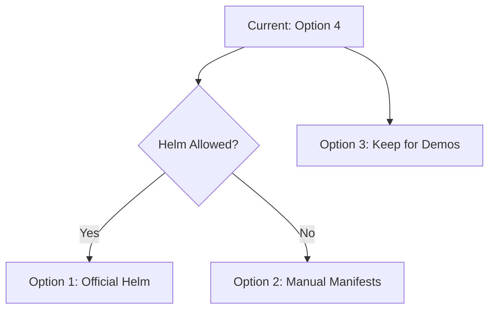

# Dagster Deployment Comparison Guide

Choose the right deployment approach based on your team's needs, infrastructure constraints, and production requirements.

## 🎯 **Quick Recommendations**

| **Scenario** | **Recommended Option** | **Why** |
|--------------|----------------------|---------|
| **Small team, getting started** | 🥇 Option 4 (Local + DB) | Fastest setup, shared history, minimal ops overhead |
| **Production deployment, Helm allowed** | 🥇 Option 1 (Official Helm) | Battle-tested, full scalability, official support |
| **Production deployment, no Helm** | 🥇 Option 2 (Manual Manifests) | Full control, production-ready, no Helm dependency |
| **Demos, POCs, training** | 🥇 Option 3 (Single Pod) | Ultra-simple, self-contained, perfect for demos |

---

## 📊 **Detailed Comparison**

### **Option 1: Official Helm Deployment**
```
🏢 PRODUCTION • 📈 HIGH SCALE • ⚡ STANDARD
```

**Best For:** Production environments where Helm is available and you need enterprise-grade deployment

| **Aspect** | **Rating** | **Details** |
|------------|------------|-------------|
| **Setup Complexity** | ⚠️ Medium | Requires Helm knowledge + container registry |
| **Production Readiness** | ✅ Excellent | Official charts, battle-tested, enterprise features |
| **Team Collaboration** | ✅ Excellent | Shared metadata, multi-user workflows |
| **Scalability** | ✅ Excellent | Auto-scaling, multi-replica, high availability |
| **Maintenance** | 🟡 Medium | Helm upgrades, chart versions, dependency management |
| **Security** | ✅ Excellent | RBAC, secrets management, network policies |

**✅ Pros:**
- Official Dagster support and updates
- Production-grade high availability
- Built-in monitoring and observability
- Easy version upgrades via Helm
- Enterprise security features

**❌ Cons:**
- Requires Helm (blocked in some production environments)
- More complex initial setup
- Higher resource consumption
- Requires container registry management

---

### **Option 2: Manual Kubernetes Manifests**
```
🏢 PRODUCTION • 🔒 SECURITY-FIRST • 🎛️ FULL CONTROL
```

**Best For:** Production environments with Helm restrictions, maximum control requirements

| **Aspect** | **Rating** | **Details** |
|------------|------------|-------------|
| **Setup Complexity** | 🟡 Medium | Kubernetes knowledge required, but well-documented |
| **Production Readiness** | ✅ Excellent | Production patterns, proper RBAC, health checks |
| **Team Collaboration** | ✅ Excellent | Shared PostgreSQL metadata storage |
| **Scalability** | ✅ Good | Manual scaling, can implement auto-scaling |
| **Maintenance** | ⚠️ Higher | Manual upgrades, manifest management |
| **Security** | ✅ Excellent | Full security control, audit-friendly |

**✅ Pros:**
- No Helm dependency (perfect for restricted environments)
- Complete control over every resource
- Single consolidated manifest file
- Easy security auditing
- Custom deployment pipeline integration

**❌ Cons:**
- Manual version management
- More operational overhead
- Requires Kubernetes expertise
- No official upgrade path

---

### **Option 3: Single Pod Demo**
```
🧪 DEMO • 🚀 ULTRA-SIMPLE • 📦 SELF-CONTAINED
```

**Best For:** Demos, POCs, training, development environments, quick testing

| **Aspect** | **Rating** | **Details** |
|------------|------------|-------------|
| **Setup Complexity** | ✅ Minimal | Single `kubectl apply`, no dependencies |
| **Production Readiness** | ❌ Not Suitable | SQLite storage, single point of failure |
| **Team Collaboration** | ❌ Limited | Local SQLite, no shared history |
| **Scalability** | ❌ None | Fixed single pod, no horizontal scaling |
| **Maintenance** | ✅ Minimal | Simple restart, no complex operations |
| **Security** | 🟡 Basic | Minimal RBAC, suitable for demos only |

**✅ Pros:**
- Fastest possible setup (2 minutes)
- Perfect for demonstrations
- Self-contained, no external dependencies
- Great for learning Dagster
- Unique approach in the Dagster ecosystem

**❌ Cons:**
- Not production suitable
- Data loss on pod restart
- No scalability or high availability
- Limited performance

---

### **Option 4: Local Development + Shared Database**
```
👥 TEAM DEV • 🎯 HYBRID • 📊 SHARED HISTORY
```

**Best For:** Development teams wanting shared visibility with local development speed

| **Aspect** | **Rating** | **Details** |
|------------|------------|-------------|
| **Setup Complexity** | ✅ Low | Local `dagster dev` + simple DB pod |
| **Production Readiness** | ❌ Dev Only | Local development pattern only |
| **Team Collaboration** | ✅ Excellent | Shared job history and asset tracking |
| **Scalability** | 🟡 Limited | Local development, shared metadata |
| **Maintenance** | ✅ Minimal | Just database pod to manage |
| **Security** | 🟡 Development | Suitable for development environments |

**✅ Pros:**
- **Solves your biggest pain point** (shared asset/job history)
- Fastest development cycle (local `dagster dev`)
- Minimal infrastructure management
- Team can see each other's work
- Perfect development-to-production progression

**❌ Cons:**
- Development environment only
- Not suitable for production workloads
- Requires local development environment setup
- Limited to development use cases

---

## 🛣️ **Migration Path Recommendations**

### **Phase 1: Start with Option 4 (Local + DB)**
- **Why:** Immediate shared visibility, minimal setup
- **Duration:** 1-2 weeks to prove value
- **Outcome:** Team adoption and workflow validation

### **Phase 2: Choose Production Strategy**


### **Phase 3: Production Deployment**
- **Option 1 Path:** Helm charts with proper CI/CD
- **Option 2 Path:** GitOps with manifest management
- **Keep Option 3:** For demos and training

---

## 🎯 **Decision Matrix**

**Choose Option 1 (Helm) if:**
- ✅ Helm is allowed in production
- ✅ You want official support and upgrades  
- ✅ You need enterprise features out-of-the-box
- ✅ You have Kubernetes + Helm expertise

**Choose Option 2 (Manual) if:**
- ✅ Helm is blocked in production
- ✅ You need maximum security control
- ✅ You want single-file deployment
- ✅ You have Kubernetes expertise

**Choose Option 3 (Single Pod) if:**
- ✅ You're doing demos or POCs
- ✅ You need ultra-simple setup
- ✅ You're training or learning
- ✅ You want something unique to show

**Choose Option 4 (Local + DB) if:**
- ✅ **Your team needs shared visibility NOW**
- ✅ You're in active development phase
- ✅ You want minimal ops overhead
- ✅ You need to prove value quickly

---

## 💡 **My Recommendation for You**

Based on your original concern: *"This solves our biggest stumbling block currently"* (shared asset/job history), I recommend:

### **🏆 Start with Option 4 immediately**
- Gets your team unblocked **today**
- Shared visibility into asset/job history
- Minimal setup and maintenance
- Proves Dagster value to your team

### **🎯 Plan for Option 2 (or 1) for production**
- Option 2 if Helm is restricted
- Option 1 if Helm is available
- Keep Option 3 for demos/training

This gives you immediate value while building toward a production-ready architecture.